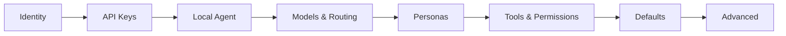
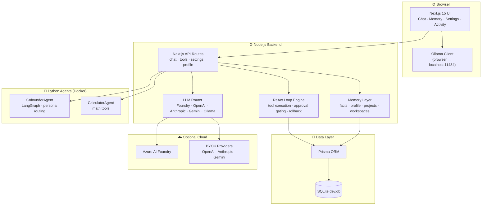
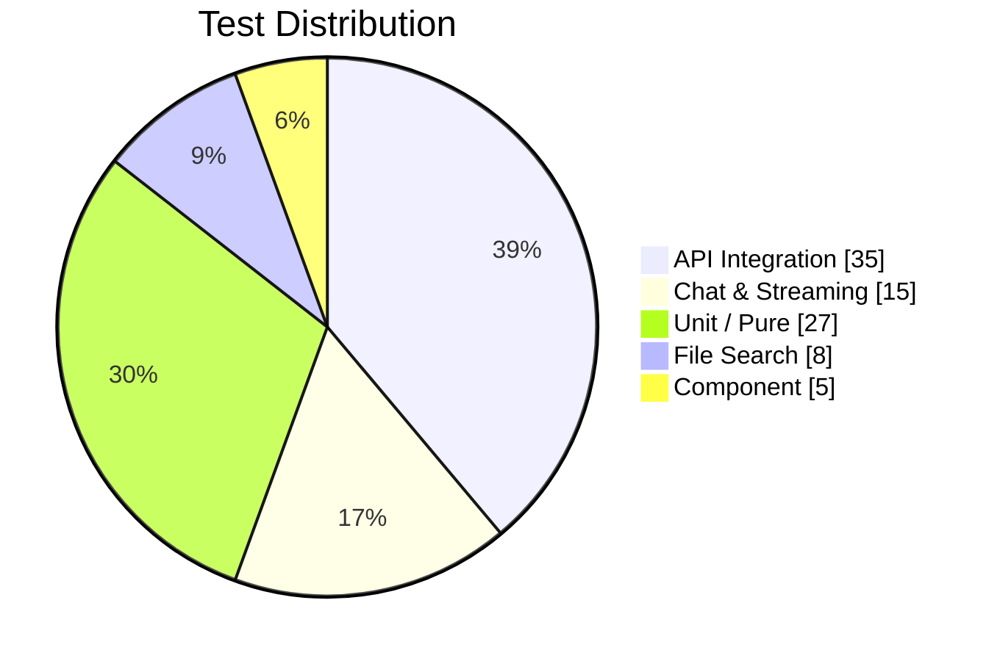

<div align="center">

<!-- Animated Typing Header -->
<a href="https://git.io/typing-svg">
  
</a>

<p align="center">
  <strong>🦙 Local-first AI coworker · 🎭 Infinite personas · 🛡️ Private by design</strong>
</p>

<p align="center">
  <a href="https://github.com/joecapella/agentroot/stargazers"></a>
  <a href="https://github.com/joecapella/agentroot/network/members"></a>
  <a href="https://github.com/joecapella/agentroot/actions/workflows/ci.yml"></a>
  <a href="https://github.com/joecapella/agentroot/blob/main/LICENSE"></a>
  <a href="https://github.com/joecapella/agentroot/issues"></a>
  
  
  
  
</p>

<!-- Centered Hero Description -->
<p align="center">
  <em>The first truly local, fully open-source Claude Code alternative.</em><br>
  <em>Claude Code was the beginning. AgentRoot is what comes next — on your machine, your models, your rules.</em>
</p>

<p align="center">
  <a href="#-get-started-in-90-seconds"><kbd> <br>🚀 Get Started<br> </kbd></a>
  <a href="#-why-agentroot"><kbd> <br>💡 Why AgentRoot?<br> </kbd></a>
  <a href="#-architecture"><kbd> <br>🏗️ Architecture<br> </kbd></a>
  <a href="#-contributing"><kbd> <br>🤝 Contribute<br> </kbd></a>
</p>

</div>

---

## 📋 Table of Contents

- [Why AgentRoot?](#-why-agentroot)
- [Killer Features](#-killer-features)
- [Get Started in 90 Seconds](#-get-started-in-90-seconds)
- [Local LLM Setup](#-local-llm-setup-guide)
- [Settings & Configuration](#️-settings--configuration)
- [Architecture](#-architecture)
- [API Contract](#-api-contract)
- [Development](#-development)
- [Contributing](#-contributing)
- [Security](#-security)
- [License](#-license)

---

## 💡 Why AgentRoot?

> **The problem:** AI coding assistants are powerful, but they lock you into cloud APIs, charge per token, and send your proprietary code to someone else's servers.
>
> **The solution:** AgentRoot runs entirely on your machine. Your prompts never leave your laptop unless *you* decide to plug in a cloud key.

### The Competition Can't Compete on Privacy

| | Claude Code | Cursor | Aider | **AgentRoot** |
|:---|:---|:---|:---|:---|
| **True Local LLMs** | ❌ Cloud only | ❌ Cloud only | ⚠️ Limited | ✅ **Ollama + HF + any OpenAI-compatible** |
| **Privacy** | 🔴 Sends code to Anthropic | 🔴 Sends code to OpenAI | 🟡 Partial | 🟢 **100% local by default** |
| **Model Freedom** | 🔒 Locked to Anthropic | 🔒 Locked to OpenAI | 🟡 Limited | 🟢 **Any model you can run** |
| **Multi-Agent System** | ❌ Single model | ❌ Single model | ❌ Single agent | ✅ **Cofounder + Calculator + custom agents** |
| **Persona System** | 🟡 Basic | 🟡 Basic | ❌ None | ✅ **5 built-in + infinite custom** |
| **Tool Safety** | 🟡 Ask every time | 🟢 Good | 🔴 Risky | ✅ **Two-step approval + rollback snapshots** |
| **Persistent Memory** | ❌ Session only | 🟡 Limited | 🟡 Git only | ✅ **Facts, projects, workspaces, rollback** |
| **Open Source** | ❌ Proprietary | ❌ Proprietary | ✅ Open | ✅ **MIT License + welcoming community** |
| **Cost** | 💰 $20+/mo | 💰 $20+/mo | 🆓 Free | 🆓 **Free forever** |

> [!TIP]
> **New to local LLMs?** Start with `qwen2.5-coder:7b` (4.7 GB) — it's small enough for most laptops and shockingly capable at coding tasks.

---

## ✨ Killer Features

<details open>
<summary><b>🦙 Ollama Native — Zero Config Local Models</b></summary>

Run `llama3`, `qwen2.5-coder`, `deepseek-coder`, `phi4`, or any GGUF model with a single command. AgentRoot detects Ollama automatically and routes all prompts locally — no API keys, no signups, no data exfiltration.

```bash
ollama pull qwen2.5-coder:14b
# AgentRoot automatically picks it up. That's it.
```

</details>

<details open>
<summary><b>🎭 Infinite Personas — One Agent, Many Minds</b></summary>

Switch personalities mid-conversation:
- **Orchestrator** — General coworker for any task
- **Code Assistant** — Deep code review, refactoring, architecture
- **Brand Designer** — Visual identity, copywriting, creative direction
- **Ops Agent** — Planning, scheduling, project management
- **Vision** — Image understanding, OCR, screenshot analysis

Create your own personas by editing `agent-config/*.prompt.md` — no code changes needed.

</details>

<details open>
<summary><b>🧠 CofounderAgent — Strategic Partner with Memory</b></summary>

A LangGraph-powered strategic agent that:
- Remembers facts about you, your stack, and your preferences across sessions
- Plans multi-step tasks with the coworker task strip
- Routes to the right model for the right job (code → Claude, vision → Kimi, fast → DeepSeek)
- Extracts `[MEMORY_FACT]` markers from conversations automatically

</details>

<details open>
<summary><b>🛡️ Safe-by-Default Tool System</b></summary>

Every destructive action (write_file, run_command, search_replace) requires explicit approval. Before you approve:
- See a diff preview of what will change
- Know exactly which files are affected
- One-click rollback to the previous state

Configure per-tool policies in Settings: **Ask** / **Allowed** / **Blocked** / **Read-only**.

</details>

<details>
<summary><b>⚡ More Features (click to expand)</b></summary>

- **🔑 BYOK Cloud Support** — Drop in OpenAI, Anthropic, Gemini, or Azure keys when you need more power
- **📦 Pluggable Everything** — Add new agents, tools, or frontends via clean interfaces
- **🖼️ Image Generation** — Generate images via GPT-Image-2 or DALL-E with quality/size controls
- **📅 Calendar Integration** — Create event drafts and list upcoming events
- **🔍 Code Search** — Built-in grep and file find across your repo
- **📝 Task Tracking** — Create todos, track approvals, monitor tool executions
- **📊 Analytics** — Token usage tracking, cost estimation, conversation history
- **🌐 Web Fetch** — Pull live documentation or research into the conversation

</details>

---

## 🚀 Get Started in 90 Seconds

> [!IMPORTANT]
> **Prerequisites:** Node.js 18+ and npm 9+ installed.

```bash
# 1. Clone & install
git clone https://github.com/joecapella/agentroot.git && cd agentroot
npm install

# 2. Set up the database
npm run db:migrate

# 3. Install Ollama (if you don't have it)
curl -fsSL https://ollama.com/install.sh | sh

# 4. Pull a coding model
ollama pull qwen2.5-coder:7b

# 5. Start AgentRoot
npm run dev

# 6. Open http://127.0.0.1:3000
```

**No API keys. No signups. No data leaving your laptop.**

> [!NOTE]
> Want cloud models too? Go to **Settings → API Keys** and paste your OpenAI, Anthropic, or Gemini key. Keys stay in your browser — never persisted on the server.

### One-Click Dev Environment

[](https://codespaces.new/joecapella/agentroot)

---

## 🦙 Local LLM Setup Guide

### Recommended Models (Tested & Fast)

| Model | Size | Best For | Command | VRAM Needed |
|:---|:---|:---|:---|:---|
| `qwen2.5-coder:7b` | 7B | Best balance of speed + quality | `ollama pull qwen2.5-coder:7b` | ~6 GB |
| `qwen2.5-coder:14b` | 14B | Best overall coding | `ollama pull qwen2.5-coder:14b` | ~10 GB |
| `deepseek-coder-v2:16b` | 16B | Complex reasoning | `ollama pull deepseek-coder-v2:16b` | ~11 GB |
| `codellama:34b` | 34B | Large codebases | `ollama pull codellama:34b` | ~22 GB |
| `llama3.1:70b` | 70B | Best quality | `ollama pull llama3.1:70b` | ~40 GB |
| `phi4` | 14B | Lightweight & fast | `ollama pull phi4` | ~10 GB |

### Using Hugging Face Models

```bash
# Pull any GGUF model from Hugging Face via Ollama
ollama pull hf.co/bartowski/Llama-3.2-3B-Instruct-GGUF
```

Then select it in **Settings → Local Agent**.

---

## ⚙️ Settings & Configuration

AgentRoot includes a comprehensive settings page at `/settings`:



| Tab | What You Configure |
|:---|:---|
| **Identity** | Display name, email, "Who I am" document injected into every conversation |
| **API Keys** | BYOK keys for OpenAI, Anthropic, Gemini — with live validation |
| **Local Agent** | Ollama URL, default model, curated model pulls, local freedom mode |
| **Models & Routing** | Override which model handles each of the 10 task kinds |
| **Personas** | Edit system prompts for all 5 built-in personas |
| **Tools & Permissions** | Per-tool policy: Ask / Allowed / Blocked / Read-only |
| **Defaults** | Default reasoning, tools mode, persona, image quality/size |
| **Advanced** | Export all data, clear conversations/facts/executions, reset to factory |

> [!TIP]
> The **"Who I am"** identity document is a game-changer. Tell AgentRoot you're a "Rust systems programmer who hates boilerplate" and every response is instantly tailored.

---

## 🏗️ Architecture



### Project Layout

```
agent-config/           # Canonical persona prompts (*.prompt.md)
app/
  api/                  # Next.js API routes
  components/           # React UI components
  lib/                  # Client utilities (apiClient, hooks, types)
  settings/             # Full settings page
src/
  CofounderAgent/       # LangGraph agent (Python, Docker)
  CalculatorAgent/      # Math agent (Python, Docker)
  server/               # Business logic (auth, tools, loop, routing)
  modelRouting.ts       # Logical → deployment mapping
  memory.ts             # Facts, profiles, workspaces
prisma/                 # Schema + migrations + SQLite DB
infra/                  # Bicep templates for Azure deployment
```

---

## 📡 API Contract

AgentRoot is a local-only single-user app. API routes do not require login, sessions, bearer tokens, or CSRF headers. Server code still derives ownership from the constant local principal (`SERVER_USER_ID`) and returns **404** (not 403) for rows that do not belong to that principal — preventing enumeration leaks.

| Method | Path | Description |
|:---|:---|:---|
| `POST` | `/api/chat` | Send a message, get SSE stream back |
| `GET` | `/api/conversations` | List user's conversations |
| `GET` | `/api/conversations/[id]` | Get conversation detail (404 if not owner) |
| `GET` | `/api/profile` | Get user profile + defaults |
| `PATCH` | `/api/profile` | Update profile, identity, defaults |
| `GET` | `/api/tool-policies` | List all tool permissions |
| `PUT` | `/api/tool-policies` | Batch update tool policies |
| `GET` | `/api/settings/routing` | Get model routing overrides |
| `PUT` | `/api/settings/routing` | Update model routing overrides |
| `POST` | `/api/settings/export` | Export all user data as JSON |
| `POST` | `/api/settings/clear` | Clear data with typed confirmation |

Error responses are always `{ error: <code>, requestId?: <uuid> }`. Full detail is logged server-side only.

---

## 🛠️ Development

```bash
# Install dependencies
npm install

# Database setup
npm run db:migrate
npm run db:generate

# Development server
npm run dev              # localhost:3000
npm run dev:lan          # 0.0.0.0:3000

# Quality gates
npm test                 # Run all tests
npm run test:coverage    # With coverage report
npm run lint             # ESLint
npm run typecheck        # TypeScript check
npm run build            # Production build
```

### Test Coverage



> [!NOTE]
> Tests use Node.js native test runner via `tsx`. No Jest, no Vitest — just Node.

---

## 🤝 Contributing

We're building the **open-source standard for private AI development**. Every contribution matters.

### 🎯 Ways to Contribute

| Role | What You Can Do | Impact |
|:---|:---|:---|
| **💻 Code** | New agents, tools, UI improvements, bug fixes | 🔥 High |
| **🎭 Prompts** | Create amazing personas in `agent-config/` | 🔥 High |
| **📝 Docs** | Tutorials, guides, README improvements | ⭐ Medium |
| **🧪 QA** | Break things, file detailed issues, improve tests | ⭐ Medium |
| **🎨 Design** | UI/UX polish, themes, accessibility | ✨ Fun |

### Quick Start for Contributors

```bash
# 1. Fork and clone
git clone https://github.com/YOUR_NAME/agentroot.git && cd agentroot

# 2. Create a branch
git checkout -b feat/my-killer-feature

# 3. Code, test, lint
npm test
npm run lint

# 4. Commit with conventional messages
git commit -m "feat: add my killer feature"

# 5. Push and open a PR
git push origin feat/my-killer-feature
```

> [!IMPORTANT]
> First time contributing? Look for issues labeled [`good first issue`](https://github.com/joecapella/agentroot/labels/good%20first%20issue) — they're perfect starting points.

See [CONTRIBUTING.md](CONTRIBUTING.md) for the full guide.

### 🏆 Contributor Recognition

- 🌟 Shoutouts in release notes
- 🏆 "AgentRoot Hero" badge on your profile
- 🚀 Fast-track to maintainer status for consistent contributors

---

## 🔒 Security

> [!WARNING]
> AgentRoot is **intentionally single-user and local-only** in v1. Do not expose the dev server to the public internet without additional authentication.

- ✅ No cloud accounts, no telemetry, no data exfiltration
- ✅ API keys live in browser localStorage only — never persisted server-side
- ✅ Tool execution is heavily gated (two-step approval + rollback snapshots)
- ✅ Secret redaction before any database persistence
- ✅ Path traversal protection on all filesystem tools
- ✅ Shell metacharacter blocking in command policy

For security vulnerabilities, please email security concerns directly rather than opening a public issue.

---

## 📜 License

MIT © [Joseph Thomas](https://github.com/joecapella)

**Built with ❤️ by developers who believe AI should empower, not lock us in.**

<div align="center">

⭐ [Star AgentRoot](https://github.com/joecapella/agentroot) ·
🐛 [Report a Bug](https://github.com/joecapella/agentroot/issues/new?template=bug_report.yml) ·
💡 [Request a Feature](https://github.com/joecapella/agentroot/issues/new?template=feature_request.yml) ·
💬 [Join Discussion](https://github.com/joecapella/agentroot/discussions)

[](https://twitter.com/joecapella)

</div>
