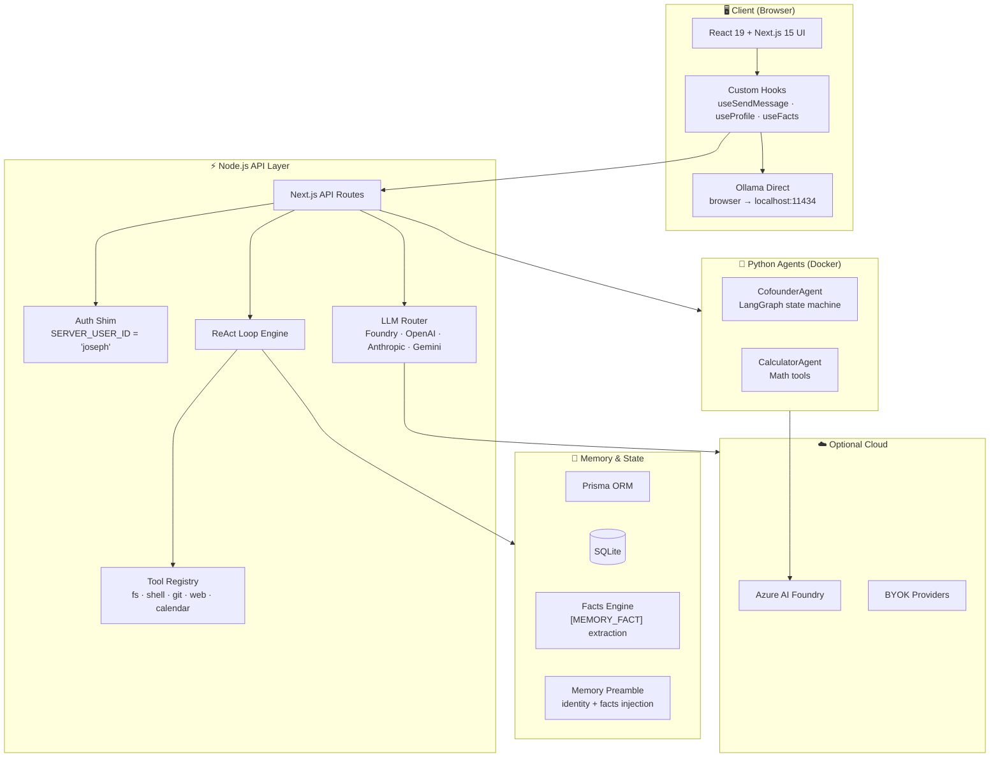
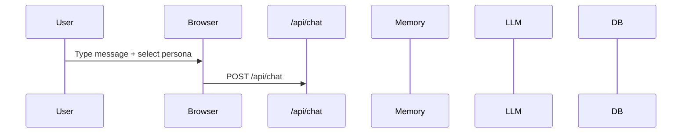
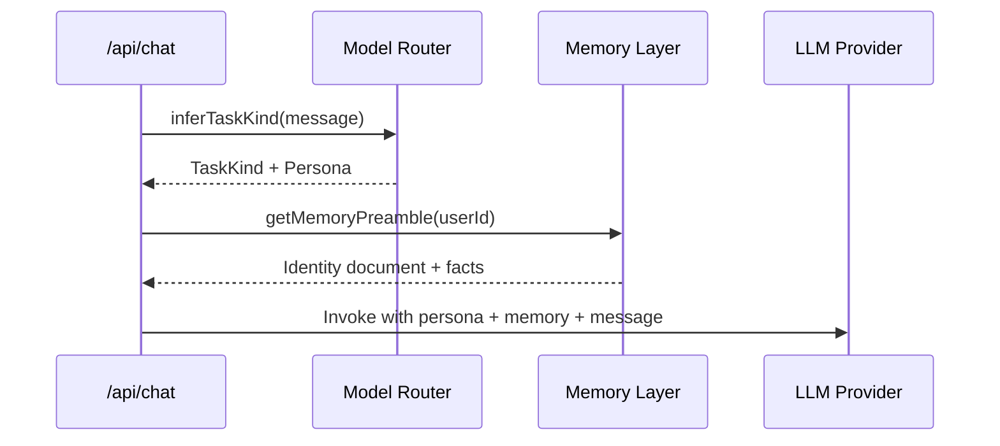
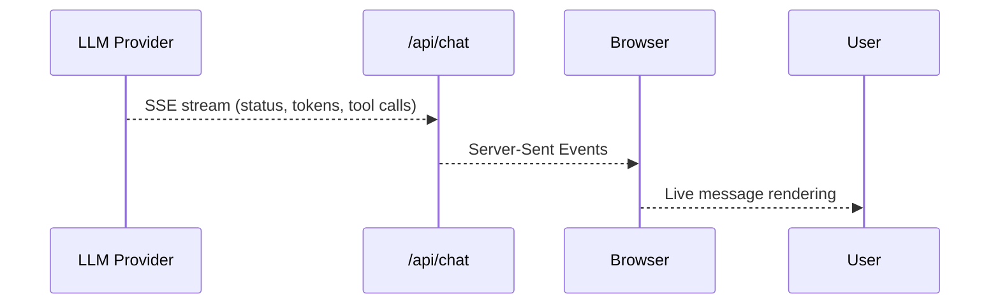
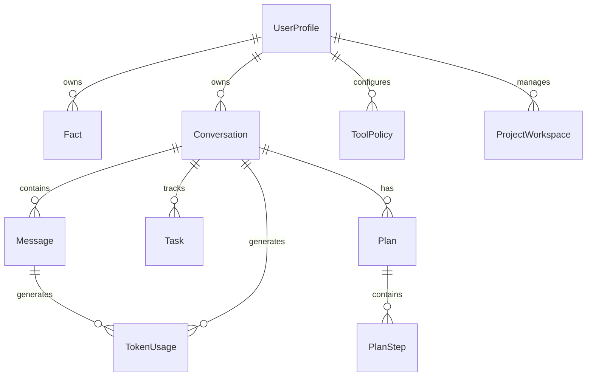

# 🏗️ AgentRoot Architecture

> A deep dive into how AgentRoot works under the hood.

---

## Design Philosophy

AgentRoot follows three core principles:

1. **Local-first by default** — Your prompts should never leave your machine unless you explicitly choose to use a cloud provider.
2. **Privacy as a feature** — No telemetry, no tracking, no data persistence you don't control.
3. **Modular and hackable** — Every component can be swapped, extended, or replaced.

---

## System Architecture



---

## Data Flow: A Single Chat Turn

### 1. User Sends a Message



### 2. Server Processes the Request



### 3. The ReAct Loop (if tools enabled)

```mermaid
sequenceDiagram
    participant LLM as LLM Provider
    participant Loop as ReAct Loop
    participant Tools as Tool Registry
    participant Approval as Approval Gate
    participant DB as Database

    LLM->>Loop: Assistant response with tool_calls
    Loop->>Loop: Check MAX_AGENT_LOOPS (25)
    Loop->>Tools: Execute safe tools directly
    Loop->>Approval: Create approval for destructive tools
    Approval-->>User: Await human approval
    User->>Approval: Approve / Reject
    Approval->>Tools: Execute approved tool
    Tools-->>Loop: Tool result
    Loop->>LLM: Feed result back as user message
    LLM->>Loop: Next response...
    Loop->>DB: Persist messages, facts, token usage
```

### 4. Response Streams to User



---

## Key Components

### Model Routing (`src/modelRouting.ts`)

AgentRoot uses a two-tier routing system:

1. **TaskKind inference** — Heuristically classifies the user's intent into 10 task kinds
2. **Logical → Deployment mapping** — Maps task kinds to actual model deployments

```typescript
// TaskKind classification
inferTaskKind("refactor this component") // → "code_file"
inferTaskKind("generate a logo")         // → "visual"
inferTaskKind("plan my week")            // → "personal_ops"

// Model resolution
ROUTES["code_file"] = {
  defaultModel: "claude-sonnet-4-6",
  fallback: "claude-opus-4-7",
  secondFallback: "gpt-5.5"
}
```

Users can override any TaskKind → Model mapping in **Settings → Models & Routing**.

### Memory Layer (`src/memory.ts`)

The memory system has three parts:

| Component | Storage | Purpose |
|:---|:---|:---|
| **UserProfile** | `prisma.userProfile` | Identity, defaults, preferences |
| **Facts** | `prisma.fact` | Auto-extracted + manually curated knowledge |
| **Preamble** | Runtime injection | Injected into every conversation |

**Fact Extraction:** The agent outputs `[MEMORY_FACT:category:importance]` markers. These are:
1. Stripped from the assistant message before DB storage
2. Persisted as Fact rows
3. Re-injected into future conversations via the memory preamble

```
[MEMORY_FACT:preference:8]
Joseph prefers Zod over Yup for validation.
[/MEMORY_FACT]
```

### Tool System

All tools live in `src/server/` and are exposed through `app/api/tools/execute/route.ts`.

| Category | Tools | Safety Level |
|:---|:---|:---|
| **Filesystem** | read_file, list_directory, write_file, search_replace | Destructive ops require approval |
| **Shell** | run_command | Always requires approval |
| **Git** | git_status, git_diff, git_log, git_branch, git_show | Safe |
| **Web** | fetch_url, open_url | open_url requires approval |
| **Search** | grep, find_files | Safe |
| **Calendar** | calendar_create, calendar_list | Safe |
| **HTTP** | http_request | Safe (user-controlled URL) |
| **Task** | create_todo | Safe |

**Approval Flow:**
1. Tool is called with `toolsMode: "ask"`
2. If tool is in `DESTRUCTIVE_TOOLS`, create `prisma.approval` row
3. Return `awaiting_approval` to client
4. Client shows approval UI
5. User approves → tool re-executes with `toolsMode: "allowed"`
6. Rollback snapshot created before any file modification

### Authentication

AgentRoot v1 is intentionally single-user. Auth is a shim:

```typescript
// src/server/auth.ts
export const SERVER_USER_ID = "joseph";

export function requireAuth(req: NextRequest): Principal {
  return { userId: SERVER_USER_ID };
}
```

All ownership checks return **404** (not 403) for non-owner rows to prevent user enumeration.

---

## Database Schema



### Key Models

| Model | Purpose |
|:---|:---|
| `UserProfile` | Identity, defaults, preferences JSON |
| `Conversation` | Chat threads with project tags |
| `Message` | Individual turns (user/assistant/tool) |
| `Fact` | Persistent memory with category + importance |
| `Task` | Trackable side effects (open_url, create_todo) |
| `ToolPolicy` | Per-user per-tool permission |
| `ToolExecution` | Audit log of all tool calls |
| `Approval` | Explicit human gate before destructive actions |
| `RollbackSnapshot` | File copies before destructive edits |
| `ProjectWorkspace` | Per-project context (goals, pinned paths) |
| `Plan` / `PlanStep` | Coworker task checklists |

---

## Python Agents

### CofounderAgent

A LangGraph-based strategic partner hosted in Docker and deployable to Azure AI Foundry.

```
src/CofounderAgent/
  main.py              # LangGraph state machine
  model_routing.py     # Python twin of src/modelRouting.ts
  prompts/             # Baked persona prompts
  agent.yaml           # Foundry hosted-agent manifest
```

**Persona Routing:** The agent reads `[persona:code_assistant]` prefixes in user messages and routes to the appropriate prompt + model.

### CalculatorAgent

A simple math tool agent for arithmetic operations.

---

## Deployment Options

### Local Development (Default)

```bash
npm run dev
# → SQLite + Ollama + no cloud
```

### BYOK Cloud

Add API keys in **Settings → API Keys**. Keys stay in browser localStorage only.

### Azure AI Foundry

Deploy Python agents via `azd up`:

```bash
cp agent-config/*.prompt.md src/CofounderAgent/prompts/
azd up
```

See [DEPLOYMENT.md](DEPLOYMENT.md) for full details.

---

## Extension Points

AgentRoot is designed to be extended:

| Extension | How |
|:---|:---|
| **New Persona** | Add `.prompt.md` to `agent-config/` |
| **New Tool** | Implement in `src/server/`, register in execute route |
| **New Model** | Add to `LOGICAL_DEPLOYMENTS` in `src/modelRouting.ts` |
| **New Agent** | Create Python container in `src/YourAgent/` |
| **New Frontend** | Replace `app/` — API is OpenAPI-documented |
| **New Database** | Change `datasource` in `prisma/schema.prisma` |

---

## Further Reading

- [Personas Guide](PERSONAS.md) — Creating and editing personas
- [Tools Guide](TOOLS.md) — Adding and configuring tools
- [Security Guide](SECURITY.md) — Threat model and safety mechanisms
- [Deployment Guide](DEPLOYMENT.md) — Production deployment options
