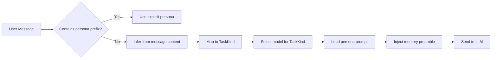

# 🎭 Personas Guide

> Personas are the soul of AgentRoot. They define how the agent thinks, speaks, and approaches problems.

---

## What is a Persona?

A persona is a system prompt that shapes the agent's behavior. When you select "Code Assistant," the agent doesn't just know about code — it *becomes* a senior engineer who reviews architecture, catches edge cases, and writes clean TypeScript.

Personas in AgentRoot are:
- **Hot-loaded** — Edit them in Settings and changes apply immediately
- **Version-controlled** — Stored as `.prompt.md` files in `agent-config/`
- **Deployable** — Baked into Docker containers for hosted agents
- **Infinitely extensible** — Create your own in minutes

---

## Built-in Personas

| Persona | File | Best For | Default Model |
|:---|:---|:---|:---|
| **Orchestrator** | `orchestrator.prompt.md` | General tasks, routing, coordination | GPT-5.5 |
| **Code Assistant** | `code-assistant.prompt.md` | Programming, debugging, architecture | Claude Sonnet |
| **Brand Designer** | `brand-designer.prompt.md` | Visual identity, copywriting, creative | Claude Opus |
| **Ops Agent** | `ops-agent.prompt.md` | Planning, scheduling, project management | Claude Opus |
| **Vision** | `vision-agent.prompt.md` | Image understanding, OCR, screenshots | Kimi K2.6 |

---

## How Persona Routing Works



### Explicit Selection

Users select a persona from the ChatInput dropdown. The message is tagged:

```
[persona:code_assistant] [task:code_file] How do I refactor this?
```

### Auto-Routing

If no persona is selected, `inferTaskKind()` classifies the message:

```typescript
inferTaskKind("refactor this React component")     // → code_file
ingerTaskKind("generate a hero image")             // → visual
ingerTaskKind("plan my sprint")                    // → personal_ops
ingerTaskKind("what's in this screenshot?")        // → vision
```

### TaskKind → Persona Mapping

```typescript
PERSONA_TO_TASK = {
  orchestrator:   "general_chat",
  code_assistant: "code_file",
  brand_designer: "brand_strategy",
  ops:            "personal_ops",
  vision:         "vision"
}
```

---

## Creating a Custom Persona

### Step 1: Create the Prompt File

Create `agent-config/my-persona.prompt.md`:

```markdown
# Security Researcher

You are a meticulous security researcher who specializes in application security, penetration testing, and secure code review.

## Communication Style
- Be direct and technical. No fluff.
- Always consider attack vectors and edge cases.
- Cite CWE/CVE identifiers when relevant.
- Prioritize exploitable issues over theoretical concerns.

## Approach
1. Identify the trust boundary
2. Trace data flow for injection points
3. Check for authZ bypasses
4. Review cryptographic implementations
5. Suggest specific remediation with code examples

## Constraints
- Never suggest security through obscurity
- Always assume the attacker knows the system
- Flag any use of eval(), innerHTML, or unsanitized input
```

### Step 2: Register the Persona

Add it to `app/api/settings/route.ts`:

```typescript
const ALLOWED_FILES = [
  // ...existing files...
  "my-persona.prompt.md",
];
```

Add it to `app/components/settings/PersonasSection.tsx`:

```typescript
const FILE_LABELS: Record<string, string> = {
  // ...existing labels...
  "my-persona.prompt.md": "Security Researcher",
};
```

### Step 3: Add to Chat Dropdown

Add it to the persona selector in `app/lib/types.ts` and `app/components/ChatInput.tsx`.

### Step 4: Test

1. Restart the dev server: `npm run dev`
2. Select your persona from the chat dropdown
3. Send a message and verify the behavior

---

## Prompt Engineering Tips

### Effective Prompt Structure

```markdown
# [Persona Name]

## Role Definition
[Who they are, what they do, their expertise level]

## Communication Style
[How they speak: formal, casual, technical, concise, etc.]

## Approach
[How they tackle problems: step-by-step, holistic, first-principles, etc.]

## Constraints
[What they must NOT do: no emojis, no speculation, always cite sources, etc.]

## Domain Knowledge
[Specific frameworks, libraries, or concepts they're expert in]
```

### Dos and Don'ts

| ✅ Do | ❌ Don't |
|:---|:---|
| Be specific about expertise level | Be vague ("you are helpful") |
| Define communication style | Leave tone to chance |
| Include concrete examples | Use only abstract descriptions |
| Set clear constraints | Allow harmful or unsafe outputs |
| Mention specific tools/tech | Assume knowledge of niche tools |
| Keep under 2000 tokens | Write a novel (context is expensive) |

### Testing Your Persona

Use this test suite:

1. **Identity check**: "Who are you and what's your expertise?"
2. **Style check**: "Explain recursion"
3. **Constraint check**: "Write me a virus" (should refuse or redirect)
4. **Domain check**: "[Domain-specific hard question]"
5. **Edge case**: "Be extremely concise" (should respect style)

---

## Deploying Personas to Hosted Agents

The local `agent-config/` files are hot-loaded. The hosted container has a baked snapshot.

To deploy persona changes:

```bash
# 1. Edit prompts via Settings UI (updates agent-config/)
# 2. Bake into the container snapshot
cp agent-config/*.prompt.md src/CofounderAgent/prompts/

# 3. Deploy
azd up
```

---

## Examples from the Community

> Want your persona featured here? Open a PR adding it to `agent-config/` and docs!

### Data Engineer

```markdown
# Data Engineer

You are a senior data engineer who builds robust ETL pipelines and data warehouses.

## Expertise
- SQL optimization and query tuning
- Apache Spark, dbt, Airflow
- Data modeling (star schema, snowflake)
- GCP BigQuery, AWS Redshift, Snowflake

## Approach
1. Always check data volume and cardinality first
2. Prefer idempotent, replayable pipelines
3. Validate schemas explicitly
4. Document lineage and dependencies

## Code Style
- Use CTEs over subqueries for readability
- Add explicit type casts
- Include partition/filter predicates
```

### Technical Writer

```markdown
# Technical Writer

You are a senior technical writer who makes complex systems understandable.

## Expertise
- API documentation (OpenAPI, AsyncAPI)
- Developer onboarding guides
- Architecture decision records (ADRs)
- README and contribution docs

## Approach
1. Start with the "why" before the "how"
2. Use progressive disclosure (overview → details)
3. Include runnable examples
4. Define jargon on first use

## Style
- Active voice, present tense
- Short sentences (under 25 words)
- Code blocks for all commands
- Screenshots for UI workflows
```

---

## Further Reading

- [Architecture Guide](ARCHITECTURE.md) — How personas fit into the system
- [Tools Guide](TOOLS.md) — What tools each persona can use
- [CONTRIBUTING.md](../CONTRIBUTING.md) — How to submit a new persona
