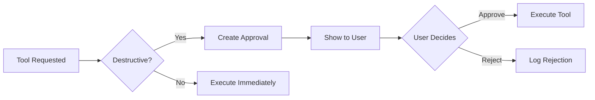

# 🔒 Security Guide

> AgentRoot is built with a **security-first, local-only** mindset. This document explains our threat model, safety mechanisms, and responsible disclosure process.

---

## Threat Model

AgentRoot v1 is designed for a **single trusted user** running on their own machine. Our threat model assumes:

| Actor | Trust Level | Mitigation |
|:---|:---|:---|
| **The user** | Fully trusted | Owns all data, controls all policies |
| **Local network** | Untrusted | Dev server binds to `127.0.0.1` by default |
| **Cloud LLM providers** | Semi-trusted | BYOK keys only, never persisted server-side |
| **Malicious prompts** | Untrusted | Tool gating, approval flow, secret redaction |
| **Supply chain** | Semi-trusted | Pinned dependencies, no telemetry |

> [!WARNING]
> **Do not expose AgentRoot to the public internet without additional authentication.** The local-only auth shim is not suitable for multi-user or public deployment.

---

## Safety Mechanisms

### 1. Two-Step Approval for Destructive Tools



**Destructive tools:** `write_file`, `search_replace`, `run_command`, `generate_image`

### 2. Path Traversal Protection

All filesystem tools use `validatePath()` with `realpathSync`-based `isInsideRoot` checks:

```typescript
// ❌ Blocked
read_file({ path: "../../../etc/passwd" })
read_file({ path: "/etc/passwd" })

// ✅ Allowed
read_file({ path: "src/server/auth.ts" })
```

### 3. Shell Metacharacter Blocking

The command policy blocks dangerous patterns:

| Pattern | Reason |
|:---|:---|
| `;` | Command chaining |
| `&&` | Conditional execution |
| `\|\|` | Alternative execution |
| `` ` `` | Command substitution |
| `$()` | Command substitution |
| `rm -rf` | Mass deletion |
| `sudo` | Privilege escalation |
| `curl \| bash` | Remote code execution |

### 4. Secret Redaction

Before persisting assistant messages to the database, secrets are redacted:

```typescript
// Patterns redacted:
- API keys (sk-*, gsk_*, etc.)
- Bearer tokens
- AWS access keys
- GitHub tokens
- JWT patterns
- Private keys
- .env file contents
```

This prevents accidental secret leakage in:
- Conversation history
- Tool execution logs
- Memory facts
- Exported data

### 5. Tool Policy Enforcement

Per-tool policies prevent unwanted tool usage:

```typescript
// User blocks write_file
await prisma.toolPolicy.create({
  data: { userId: "joseph", toolName: "write_file", policy: "blocked" }
});

// All future write_file calls return 403
```

### 6. Rollback Snapshots

Before any file modification:

```typescript
const snapDir = `/tmp/cofounder_rollback_${Date.now()}`;
createRollbackSnapshot({
  paths: [filePath],
  repoRoot,
  snapshotDir: snapDir,
});
```

Users can restore files from the rollback panel.

### 7. Ownership Checks

All database queries are scoped to `SERVER_USER_ID`. Cross-user access returns **404** (not 403) to prevent enumeration leaks.

```typescript
// Returns 404, not 403
await prisma.conversation.findFirst({
  where: { id: theirId, userId: "joseph" }
});
```

### 8. Same-Origin Header Validation

Mutating API routes require the `Origin` header to match the request URL, preventing CSRF from other origins.

---

## API Key Handling

### BYOK (Bring Your Own Key)

- Keys are stored in **browser localStorage only**
- Sent per-request in the JSON body
- Server uses them immediately, never persists them
- Redacted before any database write

```
Browser (localStorage: byok.openai)
    ↓ POST /api/chat { userKeys: { openai: "sk-..." } }
Server (uses key, redacts from response)
    ↓ Authorization: Bearer sk-... (to OpenAI)
OpenAI API
```

### Key Validation

Keys are bounded to 256 characters and validated by the provider APIs. Invalid keys result in immediate errors without side effects.

---

## Database Security

### SQLite (Development)

- Database file is `prisma/dev.db` in the project directory
- No network access
- Owned by the OS user running the process

### Postgres (Production)

When switching to Postgres:
- Use connection strings with SSL
- Restrict database user permissions
- Enable query logging for audit purposes

---

## Network Security

### Default Binding

```bash
npm run dev    # → 127.0.0.1:3000 (localhost only)
npm run dev:lan # → 0.0.0.0:3000 (LAN accessible)
```

### Ollama Communication

- Browser talks directly to `127.0.0.1:11434`
- Node server never sees Ollama traffic
- Prompts stay on the local machine

---

## Dependency Security

### No Telemetry

AgentRoot does not:
- Phone home
- Send usage analytics
- Track prompts or responses
- Include third-party analytics scripts

### Pinned Dependencies

Python agent requirements are explicitly pinned:
```
azure-ai-agentserver-core==1.0.0b3
starlette<1.0
```

### Audit

Run regular audits:
```bash
npm audit
pip-audit  # for Python agents
```

---

## Responsible Disclosure

If you discover a security vulnerability in AgentRoot:

1. **Do not open a public issue**
2. Email the maintainers directly with details
3. Include reproduction steps and impact assessment
4. Allow reasonable time for a fix before public disclosure

We commit to:
- Acknowledging receipt within 48 hours
- Providing a timeline for fixes
- Crediting you in the security advisory (if desired)

---

## Security Checklist for Contributors

When adding new features, verify:

- [ ] All filesystem paths use `validatePath()`
- [ ] Shell commands pass through `commandPolicy.ts`
- [ ] User inputs are validated with Zod schemas
- [ ] No secrets are logged or persisted
- [ ] Database queries include ownership checks
- [ ] New API routes call `requireAuth()` and `requireSameOriginHeader()`
- [ ] Destructive operations create approvals
- [ ] Error responses don't leak internal details

---

## Further Reading

- [Architecture Guide](ARCHITECTURE.md) — System design and data flow
- [Tools Guide](TOOLS.md) — Tool safety and approval mechanisms
- [CONTRIBUTING.md](../CONTRIBUTING.md) — How to contribute securely
